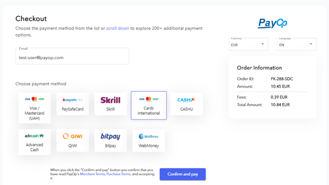
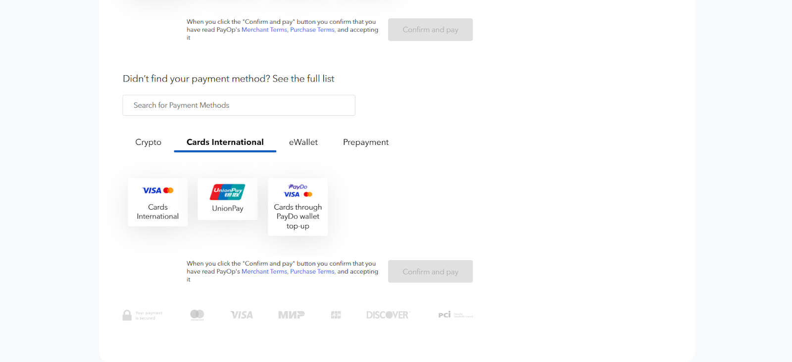
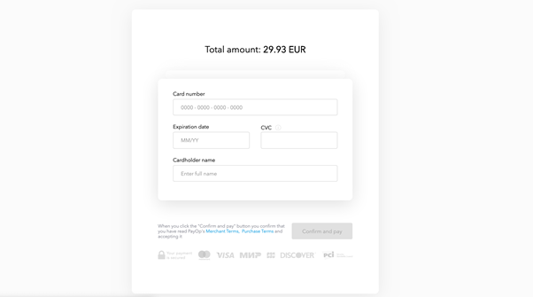

* [Back to contents](../Readme.md#contents)

# Integration API types:
##[1. Hosted Page](hostedPage.md)
This type of integration is available to everyone by default, this is the most preferable and easiest way. The checkout page is currently available in English and Russian.

The methods on the page in the upper block are displayed in accordance with the localization set in the browser being used. And for this country, payment methods are selected that are available for the country and available to the merchant. 

Methods are displayed in accordance with the payer's IP in the lower block.

The checkout page can be customized: admin panel `PayOp -> Customize`. After customization, the panel asks for confirmation from the PayOp team. 

Also it is possible to skip the checkout and integrate each method independently by passing the Method ID in the request. This will redirect the user directly to the payment data entry page using a specific method. The payer by clicking on the button of the payment method, for example, Cards International, will be taken directly to the page for entering card data for payment. 

###Features of this type of integration:

* no need to create your own checkout page, data entry form for card methods
* you don’t need to implement data processing for redirecting to the 3DS page - you can customize the standard checkout page
* no need to obtain a special certificate to be able to make payments (PCI DSS lvl 1 or 2 (AOC form) compliance)
* it will not be possible to immediately transfer the payer's card data for card methods in order to minimize the payment path
* checkout occurs on the PayOp page (there is a redirect from your domain name to payop.com) 

##[2. Server-to-server (S2S) integration](serverToServer.md)

This is a direct integration, in which the checkout page and data entry for the PM is made by the merchant himself, using any of his designs and logos, and not our developments.

To access this type of integration, the merchant must provide a document on PCI DSS lvl 1 or 2 (AOC form) compliance.
The merchant on his side processes and stores the necessary data for payment.
A special token is generated for card methods.

###Features of this type of integration:

* you can immediately transfer the payer's card data from your side for card methods (if you collect or store) in order to minimize the payment path
* payment takes place on your side, without redirecting the payer to a third-party domain
* displaying the checkout page in the language you need
* you will need to use more requests when making payments (to create a card token and checkout transactions) for card methods in the integration settings
* it is mandatory to obtain a PCI DSS lvl 1 or 2 (AOC form) compliance certificate for card methods
