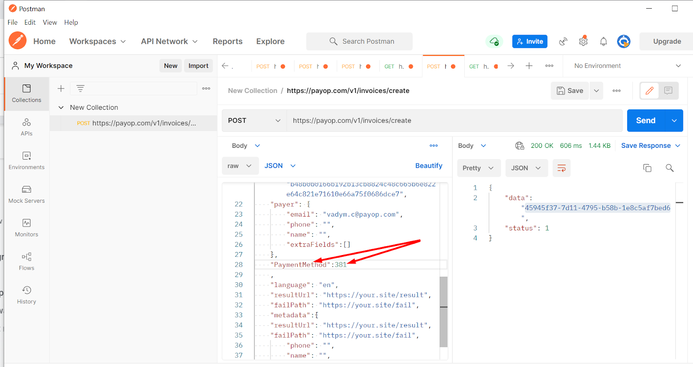

* [Back to contents](../Readme.md#contents)

# Direct integration (hosted page) 

Direct integration is a type of hosted page integration that allows to bypass the Payop hosted page.
Workflow is the same as Hosted Page, except when you make an invoice you need to add in your request required field: ''Payment methods'' with a specific number.

You can see all available payment method identifiers for your project with this query: [Get available payment methods](../Invoice/getPaymentMethods.md)