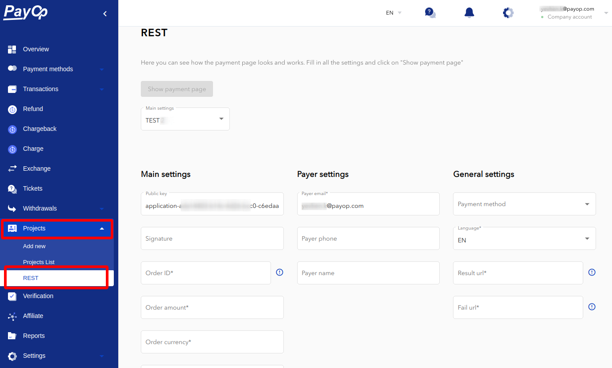
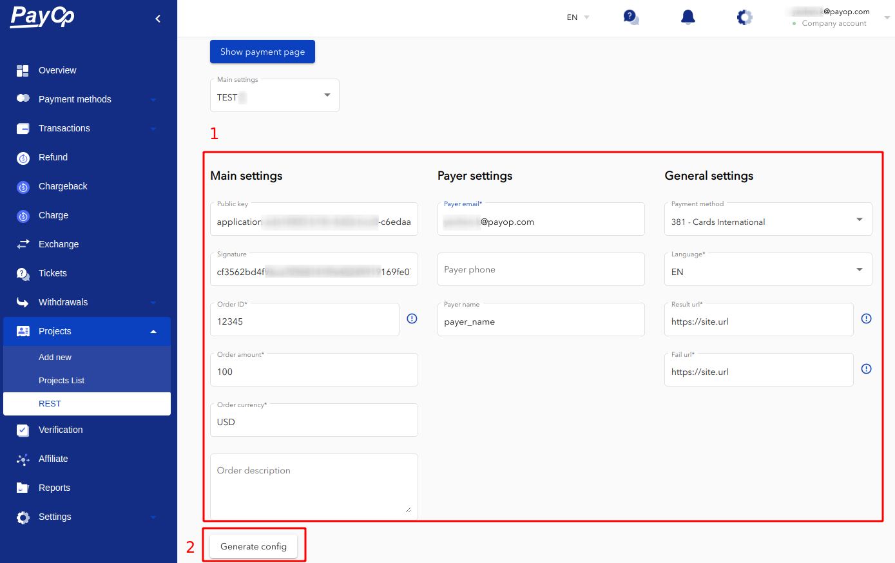
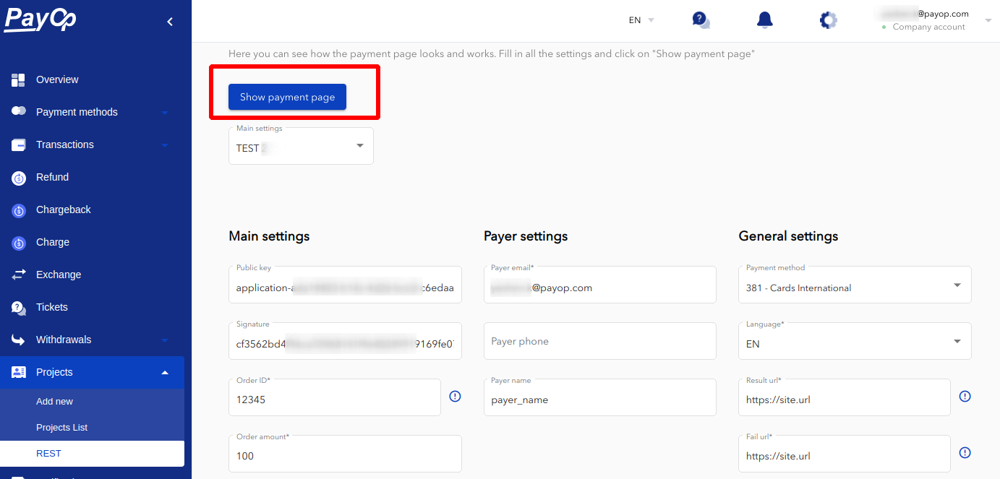
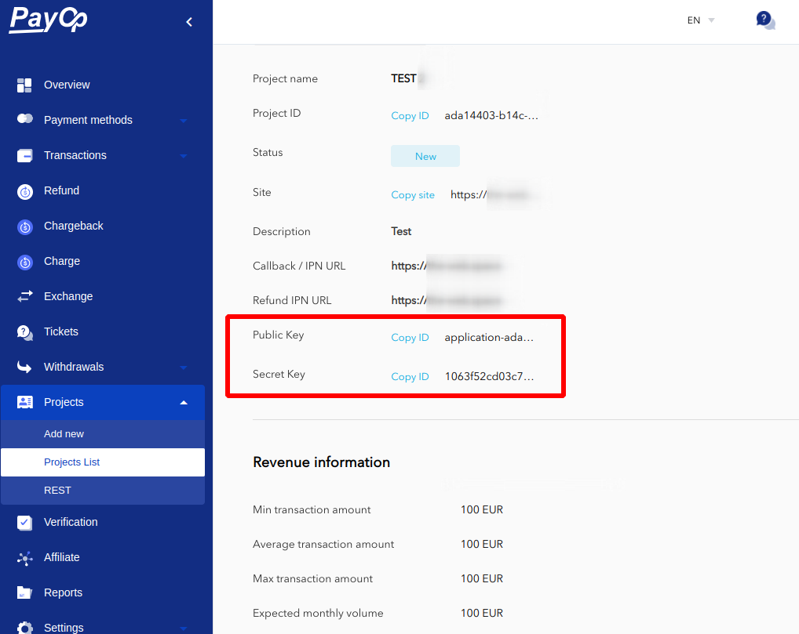

* [Back to contents](../Readme.md#contents)

# Create invoice

* [Endpoint description](#endpoint-description)
    * [Payer](#payer)
    * [Template expressions](#template-expressions)
    * [Signature](#signature)
* [Request example](#request-example)
* [Successful response example](#successful-response-example)
* [Error response example](#error-response-example)

You can create an example request in the personal merchant account in the section **Projects -> REST**:



You must fill in the order data into the respective fields to generate a page:



Click on the **“Show payment page”** button to view the **Checkout Page**:



> Please note that you can either create an invoice that will redirect 
> the payer to the checkout page with all the payments available 
> to them (for your project and the payer’s IP address and/or browser locale), 
> or an invoice redirecting the payer to a specific payment method of your choice.

For this, make use of the `paymentMethod` field of your request :

If you choose to leave it empty, a full list of payment methods available for your payer will be displayed. 
Otherwise, fill in the needed `payment method ID` to have the payer proceed to using it directly. 
You can refer to a request example in [this section](#request-example).

## Endpoint description

**Endpoint:**


```shell
https://api.payop.com/v1/invoices/create
```


```shell
Content-Type: application/json
```

**Parameters:**
  
Parameter                     | Type            | Description                                                                                              | Required |
------------------------------|-----------------|----------------------------------------------------------------------------------------------------------|----------|
publicKey &nbsp;&nbsp;&nbsp;&nbsp;&nbsp;&nbsp;&nbsp;&nbsp;&nbsp;&nbsp;&nbsp;&nbsp;&nbsp;&nbsp;&nbsp;&nbsp;&nbsp;&nbsp;&nbsp;&nbsp;&nbsp;&nbsp;&nbsp;&nbsp;&nbsp;&nbsp;&nbsp;&nbsp;&nbsp;&nbsp;&nbsp;&nbsp;&nbsp;&nbsp;&nbsp;&nbsp;&nbsp;&nbsp;&nbsp;&nbsp;                    | string          | Public key issued in the project                                                                         | *        |
**order**                     | **JSON object** | Order info                                                                                               | *        |
&emsp;order.id                | string          | Payment ID                                                                                               | *        |
&emsp;order.amount            | string          | Amount of the payment                                                                                    | *        |
&emsp;order.currency          | string          | The character code of the payment currency, which is supported by the selected payment method            | *        |
&emsp;order.description       | string          | Description of payment                                                                                   |          |
&emsp;order.items             | json array      | Products or services included in the order. An array containing arbitrary data. Can be empty array       | *        |
**payer**                     | **JSON object** | [Payer](#payer) object                                                                                   | *        |
&emsp;payer.email             | string          | Payer email                                                                                              | *        |
&emsp;payer.name              | string          | Payer name                                                                                               |          |
&emsp;payer.phone             | string          | Payer phone                                                                                              |          |
&emsp;payer.extraFields       | **JSON object** | payer extra info (fieldName:fieldValue)                                                                  |          |
language                      | string          | Language  (en, ru)                                                                                       | *        |
resultUrl                     | string          | Successful payment link. Allowed to use [template expression](#template-expressions).                    | *        |
failPath                      | string          | Unsuccessful payment link. Allowed to use [template expression](#template-expressions).                  | *        |
signature                     | string          | [Signature](#signature)                                                                                  | *        |
paymentMethod                 | string          | Payment method id selected for this invoice. One of [available payment methods](getPaymentMethods.md)   |          |
metadata                      | **JSON object** | Arbitrary structure object to store any additional merchant data. Result JSON should be less than 800 kB |          |


---

**Note:** *You can get the Public and Secret Key in the merchant admin panel in the **Projects -> Projects List -> Details section**.*

---



### Payer

The structure of the payer data contains a set of fields 
such as `email`, `name`, `phone`, `extraFields`. The `email` field 
is required. Other fields depend on the selected payment method.

It's not necessary to fill these fields at this stage, 
because you can provide the payer’s data when making a transaction. 
However, if you save the payer's data with an invoice, 
this data will be merged into the transaction later.

----

**Note:** *To avoid rigid binding to the structure, 
which does not give the entire possible list of fields 
to save all potential data, you can use `extraFields` to save the `extraFields`.*

----

**Payer object example:**
```json
{
    "email": "test.email@address.com",
    "extraFields": {
        "nationalid": "123456789",
        "name": "PAYER_NAME"
    }   
}
```

### Template expressions

Template expressions are useful when you need to make some replacements in the strings. 
Currently, only the parameters below support template expressions.

Parameter      |        Patterns          |
---------------|--------------------------| 
resultUrl      | {{invoiceId}},  {{txid}} |
failPath       | {{invoiceId}},  {{txid}} |


Pattern        |        Replacement
---------------|-------------------------------------| 
{{invoiceId}}  | Replaced with Payop invoice ID      |
{{txid}}       | Replaced with Payop transaction ID  |

**Template expression examples:**
```shell
# Template
https://your.site/result-page/?invoiceId={{invoiceId}}&txid={{txid}}
# Result
https://your.site/result-page/?invoiceId=b8bf37ab-fc69-44df-bfeb-b9a879ce20b7&txid=1eeda2f2-d3e1-4edd-853e-3d897bc629b2

# Template
https://your.site/result-page/{{txid}}/
# Result
https://your.site/result-page/1eeda2f2-d3e1-4edd-853e-3d897bc629b2/
```

### Signature

Digital signature of the payment is necessary in 
order to check the immutability/correctness of the 
data in the process of transferring them over the 
network between the participants of the payment.

Signature is required only on invoice creation.

Signature encryption method is **SHA-256**.

The parameters that make up the digital signature (the order of the parameters does matter):

**Parameters**

Parameter         | Description                                                                           | Type   | Example           |
------------------|---------------------------------------------------------------------------------------|--------|-------------------|
order.id          | Order ID in your system                                                               | string | FF01; 354         |
order.amount      | Amount of payment                                                                     | string | 100.0000          |
order.currency    | Character code of payment currency, which is supported by the selected payment method | string | USD; EUR          |
secretKey         | Project secret key                                                                    | string | rekrj1f8bc4werwer |

Signature is generated by making a **SHA-256** hash of such a string as: 
"**order.amount:order.currency:order.id:secretKey**" (values separated by **":"**, ordering and case matters).

**Signature generation example (PHP)**

```php
<?php
    $order = ['id' => 'FF01', 'amount' => '100.0000', 'currency' => 'USD'];
    ksort($order, SORT_STRING);
    $dataSet = array_values($order);
    $dataSet[] = $secretKey;
    hash('sha256', implode(':', $dataSet));
?>
```

You can use a PHP script placed [here](../examples/signatureGenerator.php) to generate signature interactively.
Copy the script to your PC and execute php path/to/script.php in terminal. 
Then provide the needed values (exactly as in the request payload) and copy the generated signature.

**Examples of signatures generated from real data**

```shell
Amount: "1.2000"
Currency: "USD"
Order ID: "Test-Order-354"
Secret key: "supersecretkey"
Result: 3445000c1f55f447b853fe068529c23fc4188e36aa4984e37836538d95f8e015
```

```shell
Amount: "0.4500"
Currency: "EUR"
Order ID: "FK-288-SDC"
Secret key: "fantastic_supersecretkey"
Result: 15c4c6ee83285dd82e1d7d29984a718cc527f218b8a0bb7e9b951b08ea1f30cd
```

## Request example

```shell
curl -X POST \
  https://api.payop.com/v1/invoices/create \
  -H 'Content-Type: application/json' \
  -d '{
    "publicKey": "YOUR_PUBLIC_KEY",
    "order": {
        "id": "12345",
        "amount": "3",
        "currency": "RUB",
        "items": [
            {
                "id": "487",
                "name": "Item 1",
                "price": "0.8999999999999999"
            },
            {
                "id": "358",
                "name": "Item 2",
                "price": "2.0999999999999996"
            }
        ],
        "description": ""
    },
    "signature": "1ab0dec9b3e6458c5ec76041e5299",
    "payer": {
        "email": "test.user@payop.com",
        "phone": "",
        "name": "PAYER_NAME",
        "extraFields": []
    },
    "paymentMethod": 261,

    "language": "en",
    "resultUrl": "https://your.site/result",
    "failPath": "https://your.site/fail"
}'
```

### Successful response example

In the case of a successful response, you can get a invoice identifier from the `identifier` header.


```shell
HTTP/1.1 200 OK
Content-Type: application/json
identifier: 81962ed0-a65c-4d1a-851b-b3dbf9750399
```

----

**Note:** *Don't use an identifier from the response body, it will be removed in the future API releases.*

----


```json
{
    "data": "",
    "status": 1
}
```

### Error response example

In case of incorrect signature generation, you will receive the following response:


```shell
HTTP/1.1 422 Unprocessable Entity
Content-Type: application/json
```


```json
{
  "message": "Wrong signature"
}
```