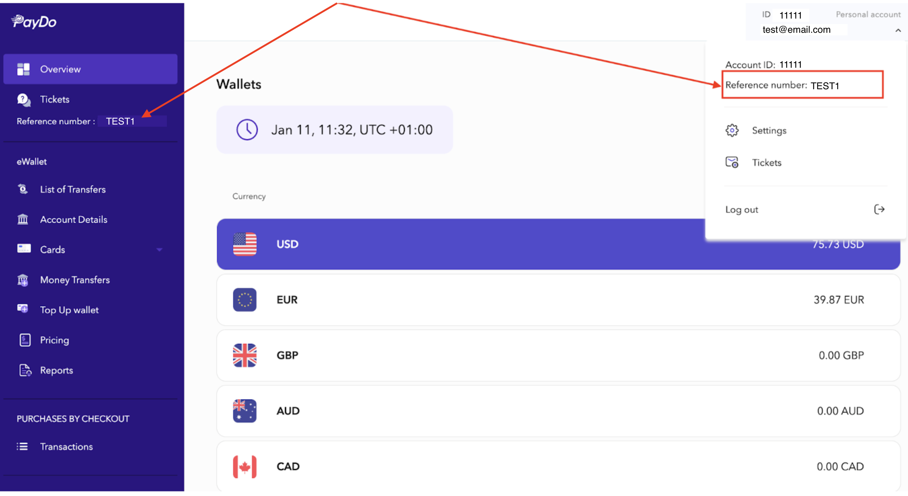

* [Back to contents](../Readme.md#contents)

# Mass (batch) withdrawal requests

This instrument allows automizing payments (for example, payments to employees, clients, partners, etc.). 
Currently, API supports batch withdrawal requests only. You can create one or more withdrawals using batch requests.

* [Endpoint description](#endpoint-description)
    * [Withdrawal method](#withdrawal-method)
    * [Commission type](#commission-type)
    * [Additional data](#additional-data)
* [Raw request data example](#withdrawal-raw-request-data-example)
* [Full request example](#full-request-example)
* [Successful response example](#successful-response-example)
* [Error response example](#error-response-example)

## Endpoint description

> **Important!** This endpoint requires [authentication](../Authentication/bearerAuthentication.md).

**Endpoint**:


```shell
https://api.payop.com/v1/withdrawals/create-mass
```


```shell
Content-Type: application/json
Authorization: Bearer YOUR_JWT_TOKEN
idempotency-key: YOUR_UNIQUE_UUID
```
To ensure the reliability and consistency of API requests, it is recommended to include the **idempotency-key** header in every request. This key should be a unique UUID for each request and helps prevent duplicate transactions in case of network issues or retries.

>**Important!** Please note the idempotency-key is an optional header.

**Parameters:**

Parameter      | Type        | Description                                                                                              | Required |
---------------|-------------|----------------------------------------------------------------------------------------------------------|----------|
method         | number      | [Withdrawal method](#withdrawal-method)                                                                  | *        |
type           | number      | [Commission type](#commission-type)                                                                      | *        |
amount         | number      | Withdrawal amount                                                                                        | *        |
currency       | string      | Withdrawal currency                                                                                      | *        |
additionalData | JSON object | [Additional data](#additional-data), depends on the selected method.                                     | *        |
metadata       | JSON object | Arbitrary structure object to store any additional merchant data. Result JSON should be less than 800 kB |          |
clientId       | string      | Unique withdrawal ID in client system                                                                    |          |

### Withdrawal methods

Possible values:

   14 - AdvCash
   15 - PayDo
<!--16 - PerfectMoney-->

You can get the full list of methods available for withdrawal by making this [request](paymentMethods.md).

### Commission type

Possible values:

    1 - take commission from wallet.  
    2 - take commission from money.

### Additional data

When you create a withdrawal request, you must transfer additional parameters for some withdrawal methods. 
Their structure and data depend on the selected method (all fields are required unless other is indicated).

You can find examples of data that need to be encrypted for each withdrawal method below.

### 14. AdvCash withdrawal data to encrypt

Required parameters:

Parameters |  Description                                                                        |
-----------|-------------------------------------------------------------------------------------|
direction  | Payment reference. Information about the purpose of the payment should be specified |
email      | Recipient's e-mail to which the account in the AdvCash system is registered         |

An example of data that needs to be encrypted before creating an AdvCash withdrawal request:

```php
$data = [
   [
       'method' => 14,
       'type' => 1,
       'amount' => 1000,
       'currency' => 'EUR',
       'additionalData' => [
           'direction' => 'direction one',          // Description. [A-Za-z0-9]
           'email' => 'example_account@email.com'   // Recipient email
       ]
   ]
];
```

### 15 - PayDo withdrawal data to encrypt

Required parameters:

Parameters           |  Description                                                                                                       |
---------------------|--------------------------------------------------------------------------------------------------------------------|
direction            | Payment reference. Information about the purpose of the payment should be specified                                |
referenceId          | Recipient identifier or email                                                                                      |
recipientAccountType | Recipient account type [personal - 1, business 2]. Specify only when using email as a value of the `referenceId`.  |

An example of data that needs to be encrypted before creating a PayDo withdrawal request:

```php
$data = [
   [
       'method' => 15,
       'type' => 1,
       'amount' => 1000,
       'currency' => 'EUR',
       'additionalData' => [
           'direction' => 'direction one',       // Description. [A-Za-z0-9]
           'email' => 'example@email.com',
           'referenceId' => 'example@email.com', // Recipient identifier or email
           'recipientAccountType' => 1           // Recipient account type. Specify only when using email as a value of the `referenceId`. [personal - 1, business - 2]
       ]
   ]
];
```
> **Important!** This data should be [encrypted](withdrawal.md#request-payload-encryptdecrypt) before sending a request.

To get the PayDo `referenceId`, click on your email/account ID in the top right corner.



<!--### 16. PerfectMoney withdrawal data to encrypt

Parameters |  Description                                                                        |
-----------|-------------------------------------------------------------------------------------|
direction  | Payment reference. Information about the purpose of the payment should be specified |
account    | Recipient's e-mail to which the account in the PerfectMoney system is registered    |

An example of data that needs to be encrypted before creating a PerfectMoney withdrawal request:

```php
$data = [
   [
       'method' => 16,
       'type' => 1,
       'amount' => 1000,
       'currency' => 'EUR',
       'additionalData' => [
           'direction' => 'direction one',           // Description. [A-Za-z0-9]
           'account' => 'example_account@email.com'  // Recipient account
       ]
   ]
];
```-->

## Full request example

```shell
curl -X POST \
  https://api.payop.com/v1/withdrawals/create-mass \
    -H 'Content-Type: application/json' \
    -H 'Authorization: Bearer YOUR_JWT_TOKEN' \
    -H 'idempotency-key: YOUR_UNIQUE_UUID' \
    -d '{"data":  "9kQ7v9nXLHjeOyIqi+hIJfEKuOCQZ2C5WWVcnmfPHUxh1EbK5g="}'
```

## Successful response example


```shell
HTTP/1.1 200 OK
Content-Type: application/json
```


```json
{
  "data": [
    {
      "id": "eab40b05-805b-5dbb-8900-a634a9ecaf57",
      "metadata": {
        "description": "Test advcash payout"
      }
    },
    {
      "id": "19b60564-e75e-5c51-988d-9b7bf69ae240",
      "metadata": {
        "description": "Test paydo payout"
      }
    }
  ],
  "status": 1
}
```

## Error response example


```shell
HTTP/1.1 422 Unprocessable Entity
Content-Type: application/json
```


```json
{
    "message": "Method must be enabled to use it"
}
```

Withdrawal methods is not available for your account. Please contact 
[Payop support](https://payop.com/en/contact-us) if you want to enable method.

<br>


```shell
HTTP/1.1 400 Bad Request
Content-Type: application/json
```


```json
{
  "message": "Unable decrypt message. Please check if it's properly encrypted"
}
```

You are using an invalid certificate or encrypting data incorrectly.

<br>


```shell
HTTP/1.1 409 Conflict
Content-Type: application/json
```


```json
{
  "message": "Not unique idempotency key"
}
```

Ensure the idempotency key is a unique UUID

<br>


```shell
HTTP/1.1 401 Unauthorized
Content-Type: application/json
```


```json
{
    "message": "Unfortunately, the selected method 2 is not supported for the payouts. Please get in touch with our support or select another method.",
    "status": 0
}
{
    "message": "The specified amount 140000 exceeds the permissible limit - 100000.00 Euro",
    "status": 0
}
{
    "message": "The specified amount 5 is less than the permissible minimum for the selected currency - 10.00 Euro",
    "status": 0
}
{
    "message": "The total amount of funds on the balances is insufficient to process the payment - 13213.01 EUR",
    "status": 0
}
{
    "message": "The selected currency GBP is not supported by method 14. To find out which currencies are available for this method, go to the 'Withdrawals' section in the merchant's cabinet.",
    "status": 0
}
{
    "message": "Decoded batch withdrawal request should be a collection of withdrawal objects",
    "status": 0
}
{
    "message": {
        "data": [
            "Incorrect withdrawal data on element with index 0: param 'method' must be integer"
        ]
    },
    "status": 0
}
{
    "message": {
        "data": [
            "Incorrect withdrawal data on element with index 0: param 'additionalData[email]' should not be empty"
        ]
    },
    "status": 0
}
```

[Authentication](../Authentication/bearerAuthentication.md) required.
