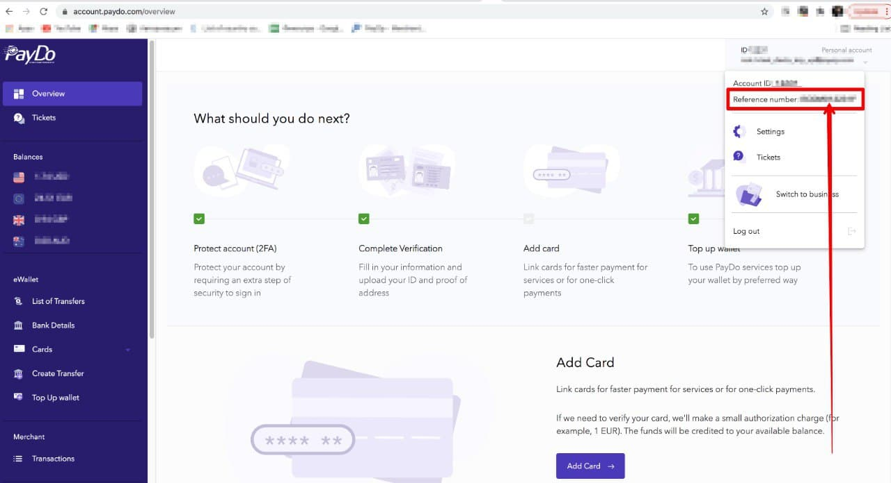

* [Back to contents](../Readme.md#contents)

# Mass (batch) withdrawal requests

Currently, API supports batch withdrawal requests only. You can create one or more withdrawals using batch requests.

* [Endpoint description](#endpoint-description)
    * [Withdrawal method](#withdrawal-method)
    * [Commission type](#commission-type)
    * [Additional data](#additional-data)
* [Raw request data example](#withdrawal-raw-request-data-example)
* [Full request example](#full-request-example)
* [Successful response example](#successful-response-example)
* [Error response example](#error-response-example)

## Endpoint description

> **Important!** This endpoint requires [authentication](../Authentication/bearerAuthentication.md).

**Endpoint**:


```shell
https://payop.com/v1/withdrawals/create-mass
```


```shell
Content-Type: application/json
Authorization: Bearer YOUR_JWT_TOKEN
```

**Parameters:**

Parameter      | Type        | Description                                                                                              | Required |
---------------|-------------|----------------------------------------------------------------------------------------------------------|----------|
method         | number      | [Withdrawal method](#withdrawal-method)                                                                  | *        |
type           | number      | [Commission type](#commission-type)                                                                      | *        |
amount         | number      | Withdrawal amount                                                                                        | *        |
currency       | string      | Withdrawal currency                                                                                      | *        |
additionalData | JSON object | [Additional data](#additional-data), depends on the selected method.                                     | *        |
metadata       | JSON object | Arbitrary structure object to store any additional merchant data. Result JSON should be less than 800 kB |          |
clientId       | string      | Unique withdrawal ID in client system                                                                    |          |

### Withdrawal methods

Possible values:

     1  - Bank transfer
     4  - Visa/MasterCard (RU cards)
     5  - Webmoney
     6  - Qiwi
     12 - Payoneer
     15 - PayDo

You can get the full list of methods available for withdrawal by making this [request](paymentMethods.md).

### Commission type

Possible values:

    1 - take commission from wallet.  
    2 - take commission from money.

### Additional data

For some of the withdrawal methods, when you create a withdrawal request, you need to transfer additional parameters.
Their structure and data depend on the selected method (all fields are required unless other is indicated).

You can find some examples of data that needs to be encrypted for each withdrawal method below.

### 1. Bank transfer withdrawal data to encrypt

```
beneficiary  - JSON object
  - account - Receiver's account (IBAN or local account number). [A-Za-z0-9]. Max. length: 34 
  - name    - Receiver's name. [A-Za-z0-9]. Max. length: 34
  - country - Receiver's country of residence. ISO 3166-1 alpha-2 code
  - city    - Receiver's city. [A-Za-z0-9]. Max. length: 34
  - state   - State or province. [A-Za-z0-9]. Required for US, CA beneficiary. Max. length: 34. 
  - address - Receiver's address. [A-Za-z0-9]. Max. length: 34
  - zipCode - Receiver's zip code. Max. length: 34
  - registrationNumber - Optional field. Registration number of the receiver. [A-Za-z0-9]. Max. length: 34
beneficiaryBank - JSON object
  - name    - Name of the Beneficiary Bank. [A-Za-z0-9]. Max. length: 34 
  - bic     - SWIFT code of the Beneficiary Bank. [A-Za-z0-9]. Max. length: 11
  - city    - Bank city. [A-Za-z0-9]. Max. length: 34
  - address - Bank address. [A-Za-z0-9]. Max. length: 68
  - zipCode - Optional field. Bank zip code. Max. length: 34 
direction    - Description. [A-Za-z0-9].
ifsc         - Optional field. Required only for IN transfers. 
routingNumber - Optional field. Required only for US, CA transfers. 
purposeCode   - Optional field. Required only for AE transfers. 
```

An example of data that needs to be encrypted before creating a Bank transfer withdrawal request:

```php
$data = [
   [
       'method' => 1,
       'type' => 1,
       'amount' => 1000,
       'currency' => 'EUR',
       'additionalData' => [
           'direction' => 'direction one',
           'email' => 'example@email.com',
           'beneficiary' => [
               'account' => '12345',    // Receiver's account (IBAN or local account number). [A-Za-z0-9]. Max. length: 34
               'name' => 'Test',        // Receiver's name. [A-Za-z0-9]. Max. length: 34
               'country' => 'FR',       // Receiver's country of residence. ISO 3166-1 alpha-2 code
               'city' => 'City',        // Receiver's city. [A-Za-z0-9]. Max. length: 34
               'state' => 'test',       // State or province. [A-Za-z0-9]. Required for US, CA beneficiary. Max. length: 34
               'address' => 'Address 1', // Receiver's address. [A-Za-z0-9]. Max. length: 34
               'zipCode' => '12345',     // Optional field. Bank zip code. Max. length: 34
               'registrationNumber' => '12345' // Optional field. Registration number of the receiver. [A-Za-z0-9]. Max. length: 34
           ],
           'beneficiaryBank' => [
               'bic' => '12345',    // SWIFT code of the Beneficiary Bank. [A-Za-z0-9]. Max. length: 11
               'name' => 'Bank',    // Name of the Beneficiary Bank. [A-Za-z0-9]. Max. length: 34
               'country' => 'FR',   // Bank country. [A-Za-z0-9]. Max. length: 34
               'city' => 'City',    // Bank city. [A-Za-z0-9]. Max. length: 34
               'address' => 'Address 2', // Bank address. [A-Za-z0-9]. Max. length: 68
               'zipCode' => '12345',    // Optional field. Bank zip code. Max. length: 34
               'direction'  => '12345', // Description. [A-Za-z0-9].
               'ifsc' => '12345',       // Optional field. Required only for IN transfers.
               'routingNumber' => '',  // Optional field. Required only for US, CA transfers.
               'purposeCode' => '12345',    // Optional field. Required only for AE transfers.
           ]
       ]
   ]
];
```

* For **CA** transfers **routingNumber** takes the format *0XXXYYYYY* and is made up of:
    * a leading 0
    * the 3 digit Bank Code (XXX)
    * the 5 digit Branch Code (YYYYY)

### 4 - Visa/MasterCard (RU cards) withdrawal data to encrypt

```
cardNumber      — card number. Example: 5555555555554444
cardHolderName  — [A-Za-z0-9]. Max. length: 50
direction       — Description. [A-Za-z0-9].
```

An example of data that needs to be encrypted before creating a cards withdrawal request:

```php
$data = [
   [
       'method' => 4,
       'type' => 1,
       'amount' => 1000,
       'currency' => 'RUB',
       'additionalData' => [
           'direction' => 'direction one',      // Description. [A-Za-z0-9].
           'email' => 'example@email.com',
           'cardNumber' => '5555555555554444',  // Card number. Example: 5555555555554444
           'cardHolderName' => 'Test'           // [A-Za-z0-9]. Max. length: 50
       ]
   ]
];
```

### 5 - Webmoney withdrawal data to encrypt

```
direction   - Description. [A-Za-z0-9].
holderName  - Holder name. [A-Za-z0-9].
country     - Country code. Must be in ISO 3166-1 alpha-2 format. Example: RU
walletNumber - Wallet number. Example: Z432423894723947823
```

An example of data that needs to be encrypted before creating a Webmoney withdrawal request:

```php
$data = [
   [
      'method' => 5,
      'type' => 1,
      'amount' => 1000,
      'currency' => 'EUR',
      'additionalData' => [
         'email' => 'example@email.com',
         'direction' => 'direction one',  // Description. [A-Za-z0-9]
         'holderName' => 'name',          // Holder name. [A-Za-z0-9]
         'country' => 'DE',               // Country code. Must be in ISO 3166-1 alpha-2 format. Example: DE
         'walletNumber' => 'Z432423894723947823' // Wallet number. Example: Z432423894723947823
      ]
   ]
];
```

### 6 - Qiwi withdrawal data to encrypt

```
direction     - Description. [A-Za-z0-9].
walletNumber  - Wallet number. Example: +7451684153189138
country       - Country code. Must be in ISO 3166-1 alpha-2 format. Example: RU
```

An example of data that needs to be encrypted:

```php
$data = [
   [
       'method' => 6,
       'type' => 1,
       'amount' => 1000,
       'currency' => 'RUB',
       'additionalData' => [
           'direction' => 'direction one',          // Description. [A-Za-z0-9].
           'email' => 'example@email.com',
           'walletNumber' => '+7451684153189138',   // Wallet number. Example: +7451684153189138
           'country' => 'DE'                        // Country code. Must be in ISO 3166-1 alpha-2 format. Example: DE
       ]
   ]
];
```

### 12 - Payoneer withdrawal data to encrypt

An example of data that needs to be encrypted:

```php
$data = [
    [
       'method' => 12,
       'type' => 1,
       'amount' => 100,
       'currency' => 'EUR',
       'additionalData' => [
            'direction' => 'direction one',   // Description. [A-Za-z0-9]
            'payeeId' => 'example@email.com', // Payoneer ID,  Example: 324344332 or test@gmail.com
            'accountType' => 'account'
       ]
    ]
 ];
```

### 15 - PayDo withdrawal data to encrypt

```
direction   - Description. [A-Za-z0-9].
referenceId - Recipient identifier or email. 
recipientAccountType - Recipient account type. Specifiy only when using email as a value of the `referenceId`. [personal - 1, business 2]
```

An example of data that needs to be encrypted before creating a PayDo withdrawal request:

```php
$data = [
   [
       'method' => 15,
       'type' => 1,
       'amount' => 1000,
       'currency' => 'EUR',
       'additionalData' => [
           'direction' => 'direction one',       // Description. [A-Za-z0-9]
           'email' => 'example@email.com',
           'referenceId' => 'example@email.com', // Recipient identifier or email
           'recipientAccountType' => 1           // Recipient account type. Specify only when using email as a value of the `referenceId`. [personal - 1, business - 2]
       ]
   ]
];
```

> **Important!** This data should be [encrypted](withdrawal.md#request-payload-encryptdecrypt) before sending a request.

To get the PayDo `referenceId` you should click on the top right corner where your email/account ID is.



## Full request example

```shell
curl -X POST \
  https://payop.com/v1/withdrawals/create-mass \
    -H 'Content-Type: application/json' \
    -H 'Authorization: Bearer YOUR_JWT_TOKEN' \
    -d '{"data":  "9kQ7v9nXLHjeOyIqi+hIJfEKuOCQZ2C5WWVcnmfPHUxh1EbK5g="}'
```

## Successful response example


```shell
HTTP/1.1 200 OK
Content-Type: application/json
```


```json
{
  "data": [
    {
      "id": "eab40b05-805b-5dbb-8900-a634a9ecaf57",
      "metadata": {
        "description": "Test bank transfer payout"
      }
    },
    {
      "id": "19b60564-e75e-5c51-988d-9b7bf69ae240",
      "metadata": {
        "description": "Test international cards payout"
      }
    }
  ],
  "status": 1
}
```

## Error response example


```shell
HTTP/1.1 422 Unprocessable Entity
Content-Type: application/json
```


```json
{
    "message": "Method must be enabled to use it"
}
```

Withdrawal methods is not available for your account. Please contact 
[Payop support](https://payop.com/en/contact-us) if you want to enable method.

<br>


```shell
HTTP/1.1 400 Bad Request
Content-Type: application/json
```


```json
{
  "message": "Unable decrypt message. Please check if it's properly encrypted"
}
```

You are using an invalid certificate or encrypting data incorrectly.

<br>


```shell
HTTP/1.1 401 Unauthorized
Content-Type: application/json
```


```json
{
  "message": "Full authentication is required to access this resource."
}
```

[Authentication](../Authentication/bearerAuthentication.md) required.
