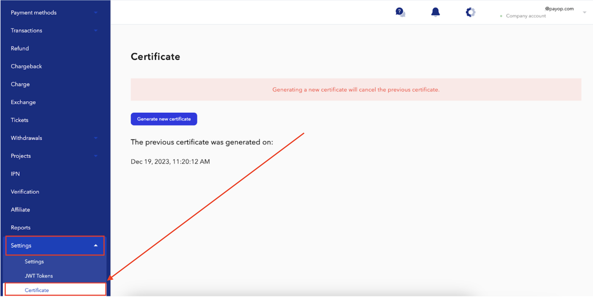

* [Back to contents](../Readme.md#contents)

# Withdrawal

<br>

> **Important!** Prior to creating a withdrawal request, you need to create a certificate and [encrypt request payload](#request-payload-encryptdecrypt). You can **download** your personal certificate to [your account](https://payop.com/en/profile/settings/certificate). When you generate the certificate, you receive the 2 Factor Authentication code on your registered email/application. This 6-digit verification code should be entered in the required field to create a certificate.



## Withdrawal flow

<br>

> **Important!** Withdrawal is an asynchronous operation, i.e. you will not
> get the final status immediately after a withdrawal creation.

1. [Create withdrawal request](massWithdrawal.md)
2. Save a withdrawal ID from the response (`id` property from response object related to a particular withdrawal)
3. [Check withdrawal status by getting withdrawal details](getWithdrawal.md)
   every 10 minutes (available statuses: 1, 4 - Pending; 2 - Accepted; 3 - Rejected).

----

**Note:** Your application has to change the withdrawal status on your side only in case you get the final status from
Payop (2 or 3). For example, if you get a 500 HTTP error code (or something similar) when you make a 
request to get withdrawal details, you don't need to change the withdrawal
status. Just leave it pending and repeat the request later.

----

## Request payload encrypt/decrypt

When creating a request for withdrawal, you need to encrypt the request payload with a personal certificate. We are
using a popular encryption library to decrypt the request payload -
[Sodium](https://libsodium.gitbook.io/doc/). In short, before sending a withdrawal request, you have to follow the steps
below:

* Encrypt request payload
  with [Sodium Sealed boxes](https://libsodium.gitbook.io/doc/public-key_cryptography/sealed_boxes#usage)
  ( [Python](https://libnacl.readthedocs.io/en/latest/topics/raw_sealed.html),
  [PHP](https://www.php.net/manual/en/function.sodium-crypto-box-seal.php) ).
* Encode encrypted binary string with Base64.

Below you can see a PHP example of how to encrypt the request payload before sending a withdrawal request:

```php
// Original certificate file that was downloaded from the site (payop.com). It's contains a binary string.
$certFilePath = '/project/x25519.pub';
// You can use below example to encode it or use linux console command: cat /project/x25519.pub | base64 
$certificate = file_get_contents($certFilePath);
$data = [
    [
        'method' => 8,
        'type' => 1,
        'amount' => 34,
        'currency' => 'USD',
        'additionalData' => [
            'direction' => 'direction one',
            'email' => 'my.email@address.com'
        ]
    ]
];

$encryptedPayload = sodium_crypto_box_seal(json_encode($data), $certificate);
// $encryptedPayload - it's a binary string
$base64Payload = base64_encode($encryptedPayload);
// $base64Payload - looks like a next string 9kQ7v9nXLHjeOyIqi+hIJfEKuOCQZ2C5WWVcnmfPHUxh1EbK5g=
```

See more examples [here](../examples/apiCertificates).
