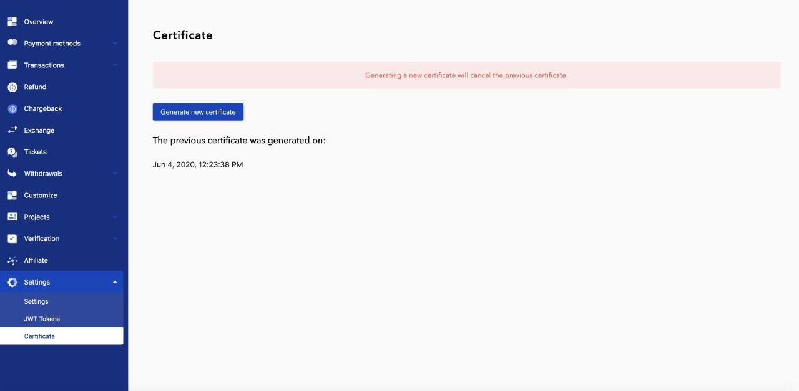

# Withdrawal

**Important!** To create a withdrawal request, you must first [receive a token for your user](authentication.md),
 as described in the [login section](authentication.md) and create a certificate to encrypt request payload.
 1. When creating a request for withdrawal, you must transfer a personal token in the header of the http request.
 2. When creating a request for withdrawal, you must encrypt request payload with a personal certificate.
  You can **download** your personal certificate in [your account](https://payop.com/en/profile/settings/certificate).
  
  

#### Withdrawal flow

**Important!** Withdrawal is asynchronous operation. That is means that you never get final status on withdrawal create action.

 1. [Create withdrawal request](#mass-batch-withdrawal-requests)
 2. Save withdrawal id from response (`id` property from response object related to concrete withdrawal)
 3. [Check withdrawal status by getting withdrawal details](#get-concrete-withdrawal-details)
  every 10 minutes (available statuses: 1 - Pending; 2 - Accepted; 3 - Rejected).

----
**Note:** Your application have to change withdrawal status on your side only in case you get final status from Payop (2 or 3). 
As example, if you are getting 500 http error code (or something like this) when you make request to get withdrawal details,
you don't need to change withdrawal status. Just leave it as pending and repeat request later.

----

 
#### Request payload encrypt/decrypt

We are using popular encryption library to decrypt request payload - [Sodium](https://libsodium.gitbook.io/doc/).
In short, before send withdrawal request you have to make next steps:
 
* Encrypt request payload with [Sodium Sealed boxes](https://libsodium.gitbook.io/doc/public-key_cryptography/sealed_boxes#usage)
(
    [Python](https://libnacl.readthedocs.io/en/latest/topics/raw_sealed.html),
    [PHP](https://www.php.net/manual/en/function.sodium-crypto-box-seal.php)
)
* Encode encrypted binary string with Base64
 
Below you can see PHP example, how encrypt request payload before send withdrawal request:

```php
$certificate = file_get_contents('path_to_certificate');
$data = [
    [
            'method' => 8,
            'type' => 1,
            'amount' => 34,
            'currency' => 'USD',
            'additionalData' => [
                'direction' => 'direction one',
                'email' => 'my.email@address.com'
            ]
    ]
];

$encryptedPayload = sodium_crypto_box_seal(json_encode($data), $certificate);
// $encryptedPayload - it's a binary string
$base64Payload = base64_encode($encryptedPayload);
// $base64Payload - looks like a next string 9kQ7v9nXLHjeOyIqi+hIJfEKuOCQZ2C5WWVcnmfPHUxh1EbK5g=
```

See more examples [here](examples/apiCertificates)

### Mass (batch) withdrawal requests

Only batch withdrawal request available using API. You can create **1** or more withdrawal using batch request. 

**Endpoint**: https://payop.com/v1/withdrawals/create-mass

**Content-Type**: application/json

**Headers**:
 
    Content-Type: application/json
    Authorization: Bearer eyJ0eXAiO...

**Withdrawal RAW DATA Example (this data should be encrypted, see below)**

```json
[
    {
        "method": 8,
        "type": 1,
        "amount": 34,
        "currency":"USD",
        "additionalData": {
            "direction": "direction one",
            "email": "my.email@address.com"
        }
    },
    {
        "method": 6,
        "type": 1,
        "amount": 35,
        "currency":"USD",
        "additionalData": {
            "direction": "direction two",
            "walletNumber": "my wallet number",
            "country": "USA"
        }
    }
]
```

**Withdrawal Request with encrypted data Example**

```json
{"data":  "9kQ7v9nXLHjeOyIqi+hIJfEKuOCQZ2C5WWVcnmfPHUxh1EbK5g="}
```

**Parameters:**

* **method** -- withdrawal method (numeric field):

     1 - Bank transfer.
     
     2 - International Cards.
     
     3 - Visa/MasterCard (UA cards).
     
     4 - Visa/MasterCard (RU cards).
     
     5 - Webmoney
     
     6 - Qiwi
     
     8 - Paypal.
     
     11 - Bitcoin.

* **type** -- commission type: 1 - take commission from wallet or 2 - take commission from money.
* **amount** -- withdraw amount.
* **currency** -- withdraw currency.
* **additionalData** -- The content of the block depends on the method.
* **metadata** [JSON object] -- Arbitrary structure object to store any additional merchant data. Result JSON should be less than 800 kB

We present the fields in accordance with different values of the method field
 (all below fields are required unless otherwise indicated):

 1. Bank transfer
 ```
     beneficiary - JSON object
        - account - Receiver's account (IBAN or local account number). [A-Za-z0-9]. Max. length: 34 
        - name - Receiver's name. [A-Za-z0-9]. Max. length: 34
        - country - Receiver's country of residence. ISO 3166-1 alpha-2 code
        - city - Receiver's city. [A-Za-z0-9]. Max. length: 34
        - address - Receiver's address. [A-Za-z0-9]. Max. length: 34
        - registrationNumber - Optional field. Registration number of the receiver. [A-Za-z0-9]. Max. length: 34
     beneficiaryBank - JSON object
        - name - Name of the Beneficiary Bank. [A-Za-z0-9]. Max. length: 34 
        - bic - SWIFT code of the Beneficiary Bank. [A-Za-z0-9]. Max. length: 11 
     direction - Description. [A-Za-z0-9].
     afsk - Optional field. Only for IN transfers. 
     routingNumber - Optional field. Only for US transfers. 
```    

 2. International Cards
```
     cardNumber - Example: 5555555555554444 
     expirationDate - format: MM/YYYY
     cardHolderName - [A-Za-z0-9]. Max. length: 50
     cardholderBirthDate - format: YYYY-MM-DD
     firstAddressLine - [A-Za-z0-9]. Max. length: 50
     secondAddressLine - [A-Za-z0-9]. Max. length: 50
     city - [A-Za-z0-9]. Max. length: 50. Example: Kyiv
     country - Country code. Must be in ISO 3166-1 alpha-2 format. Example: US
     zipCode - [A-Za-z0-9]. Max. length: 20
     direction - Description. [A-Za-z0-9].
```

3. Visa/MasterCard (UA cards).
```
     cardNumber - card number. Example: 5555555555554444
     cardHolderName — [A-Za-z0-9]. Max. length: 50
     direction - Description. [A-Za-z0-9].
```
        
4. Visa/MasterCard (RU cards).
```
     cardNumber - card number. Example: 5555555555554444
     cardHolderName — [A-Za-z0-9]. Max. length: 50
     direction - Description. [A-Za-z0-9].
```
        
5. Webmoney.
```
     direction - Description. [A-Za-z0-9].
     walletNumber - wallet number. Example: Z432423894723947823
```
    
6. Qiwi.
```
     direction - Description. [A-Za-z0-9].
     walletNumber - wallet number. Example: +7451684153189138
     country - Country code. Must be in ISO 3166-1 alpha-2 format. Example: RU
```
     
7. Yandex money.
```
     direction - Description. [A-Za-z0-9].
     walletNumber - wallet number.
```

8. Paypal.
```
     direction - Description. [A-Za-z0-9].
     email - recipient email
```
     
11. Bitcoin.
```     
     direction - Description. [A-Za-z0-9].
     data -  bitcoin wallet
```

**Withdrawal RAW DATA Example (this data should be encrypted)**

Create request for withdraw to the Visa/MasterCard (RU cards).

```json
[
    {
        "method": 4,
        "type": 1,
        "amount": 100,
        "currency":"RUB",
        "additionalData": {
            "cardNumber": "4444444444444444",
            "cardHolderName": "Ivan Ivanov"
        },
        "metadata": {
            "internal merchant id": "example"
        }
    }
]
```

**Withdrawal Response Example**

```json
{
    "data": [
        {
            "id": "eab40b05-805b-5dbb-8900-a634a9ecaf57",
            "metadata": {
                "description": "Test bank transfer payout"
            }
        },
        {
            "id": "19b60564-e75e-5c51-988d-9b7bf69ae240",
            "metadata": {
                "description": "Test international cards payout"
            }
        }
    ],
    "status": 1
}
```


### List of payment methods available to the merchant

**Endpoint**: https://payop.com/v1/instrument-settings/payment-methods/available-withdrawal-for-user

**Content-Type**: application/json

**Headers**:
 
    Content-Type: application/json
    Authorization: Bearer eyJ0eXAiO...
    
**Request example:**

```shell script
curl -X GET \
  https://payop.com/v1/instrument-settings/payment-methods/available-withdrawal-for-user \
    -H 'Content-Type: application/json' \
  -H 'Authorization: Bearer eyJ0eXAiOiJKV...
```    

**Successful response example:**

```json
{
    "data": [
        {
            "identifier": 1000008,
            "type": 4,
            "name": "manual_visa_ru_cards",
            "title": "Visa/MasterCard (Russian cards)",
            "currencies": [
                "RUB"
            ]
        },
        {
            "identifier": 1000005,
            "type": 1,
            "name": "manual_bank_transfer",
            "title": "Bank Transfer",
            "currencies": [
                "CAD",
                "CHF",
                "DKK",
                "EUR",
                "GBP",
                "JPY",
                "NZD",
                "SEK",
                "USD"
            ]
        },
        {
            "identifier": 1000003,
            "type": 6,
            "name": "manual_qiwi",
            "title": "Qiwi",
            "currencies": [
                "RUB"
            ]
        }
    ],
    "status": 1
}
```

### Merchants withdraw transactions

**Endpoint:**

`GET https://payop.com/v1/withdrawals/user-withdrawals`

`GET https://payop.com/v1/withdrawals/user-withdrawals?query[identifier]={payopWithdrawalId}`

**Headers:**
 
    Content-Type: application/json
    Authorization: Bearer eyJ0eXAiO...

**Request example:**

```shell script
curl -X GET \
  https://payop.com/v1/withdrawals/user-withdrawals \
    -H 'Content-Type: application/json' \
  -H 'Authorization: Bearer eyJ0eXAiOiJKV...
```

**Successful response example:**

```json
{
    "data": [
        {
            "identifier": "0000000-0000-0000-0000-00000001",
            "groupIdentifier": null,
            "userIdentifier": "10043",
            "type": 1,
            "currency": "RUB",
            "amount": 100,
            "transactionIdentifier": "0000000-0000-0000-0000-00000001",
            "status": 1, // Pending
            "method": 4,
            "createdAt": 1568112855,
            "updatedAt": null,
            "additionalData": {
                "direction": "Dm PENDING test withdrawal",
                "cardNumber": "4444444444444444",
                "cardHolderName": "Ivan Ivanov"
            },
            "metadata": {
                "internal merchant id": "example"
            }
        },
        {
            "identifier": "0000000-0000-0000-0000-00000002",
            "groupIdentifier": null,
            "userIdentifier": "10043",
            "type": 1,
            "currency": "RUB",
            "amount": 65,
            "transactionIdentifier": "0000000-0000-0000-0000-00000002",
            "status": 2, // Accepted
            "method": 6,
            "comment": null,
            "createdAt": 1579502520,
            "updatedAt": 1579502818,
            "metadata": [],
            "additionalData": {
                "direction": "Dm ACCEPTED test withdrawal",
                "country": "UA",
                "walletNumber": "+3800000000"
            }
        },
        {
            "identifier": "0000000-0000-0000-0000-00000003",
            "groupIdentifier": null,
            "userIdentifier": "10043",
            "type": 1,
            "currency": "RUB",
            "amount": 65,
            "transactionIdentifier": "0000000-0000-0000-0000-00000003",
            "status": 3, // Failed
            "method": 6,
            "comment": null,
            "createdAt": 1579502520,
            "updatedAt": 1579502818,
            "metadata": [],
            "additionalData": {
                "direction": "Dm FAILED test withdrawal",
                "country": "UA",
                "walletNumber": "+3800000000"
            }
        }
    ],
    "status": 1
}
```

### Get concrete withdrawal details


**Endpoint:**

`GET https://payop.com/v1/withdrawals/user-withdrawals?query[identifier]={payopWithdrawalId}`

**Headers:**
 
    Content-Type: application/json
    Authorization: Bearer eyJ0eXAiO...

**Request example:**

```shell script
curl -X GET \
  https://payop.com/v1/withdrawals/user-withdrawals?query[identifier]={payopWithdrawalId} \
  -H 'Content-Type: application/json' \
  -H 'Authorization: Bearer eyJ0eXAiOiJKV...
```

**Successful response example:**

```json
{
    "data": [
        {
            "identifier": "{payopWithdrawalId}",
            "groupIdentifier": null,
            "userIdentifier": "10043",
            "type": 1,
            "currency": "RUB",
            "amount": 100,
            "transactionIdentifier": "0000000-0000-0000-0000-00000001",
            "status": 1,
            "method": 4,
            "createdAt": 1568112855,
            "updatedAt": null,
            "additionalData": {
                "cardNumber": "4444444444444444",
                "cardHolderName": "Ivan Ivanov"
            },
            "metadata": {
                "internal merchant id": "example"
            }
        }
    ],
    "status": 1
}
```
